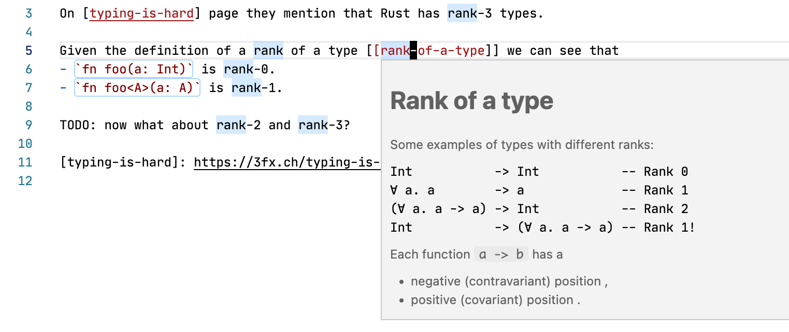
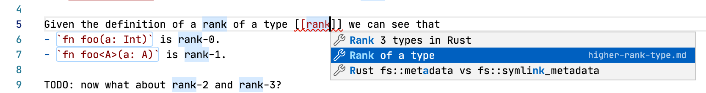
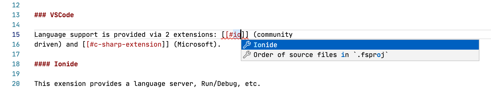
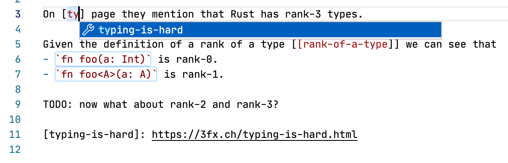
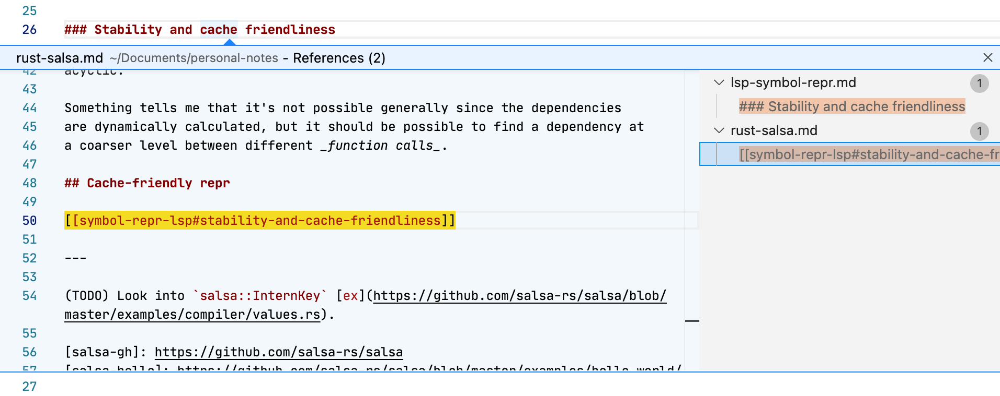
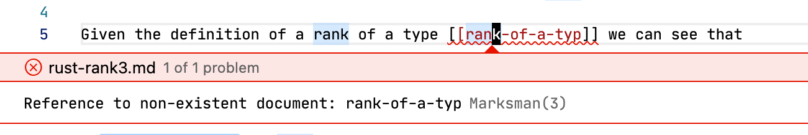

# Marksman VSCode

Integrates [Marksman][mn] language server into VSCode for delightful Markdown
note taking experience.

See the [project page][mn] for more detailed information.

## Screenshots

- Hover preview:
  
- Completion:
  
  - Wiki link to another document:
    

  - Wiki link to a subsection of the current document:
    

  - Reference link:
    
- "Show References":
  
- Project-wide diagnostics for broken wiki-links:
  

## Installation

1. **Get `marksman` server binary**.
   The extension will try to automatically download Marksman language server
   from GH releases. This is the easiest way to get started.

   An alternative is to either download `marksman` binary from the [releases
   page][mn-releases] or to build `marksman` from source. Put it somewhere in
   your `PATH` and you should be good to go.
2. **Add `.marksman.toml` to your workspace root folder**.
   The extension is automatically activated only when `.marksman.toml` file is
   present. This is done to avoid running Zeta Note on random Markdown files,
   but rather only inside your notes folder.

## Extension Settings

- **Custom Command**: allows to specify a custom command to start
  `marksman`. Mostly useful for development of `marksman` itself.
- **Custom Command Dir**: allows to specify a CWD for the command above. For
  development it's convenient to set the command to `dotnet run` and the command
  dir to the dir where `marksman` sources are.

## Development
- **Set things up**: 
  - Run `npm install` to get the necessary packages.
  - Run `npm watch` or hit F5 to do development/debugging.
- **Package and release**:
  - Install vsce via `npm install -g vsce`.
  - Run `vsce package` to package the extension.
  - Run `vsce publish` to publish the packaged archive.
- **Local installation**:
  - Run `code --install-extension [path-to-vsix]` to install the locally built extension.

[roam]: https://roamresearch.com
[md-memo]: https://github.com/svsool/vscode-memo
[mn]: https://github.com/artempyanykh/marksman
[mn-releases]: https://github.com/artempyanykh/marksman/releases