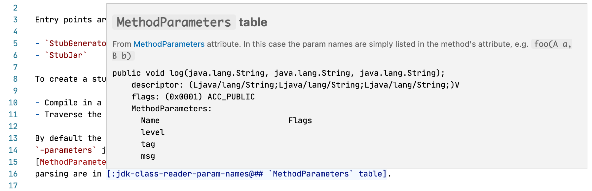
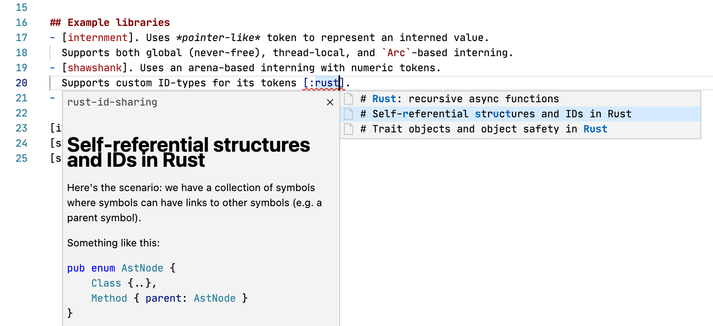
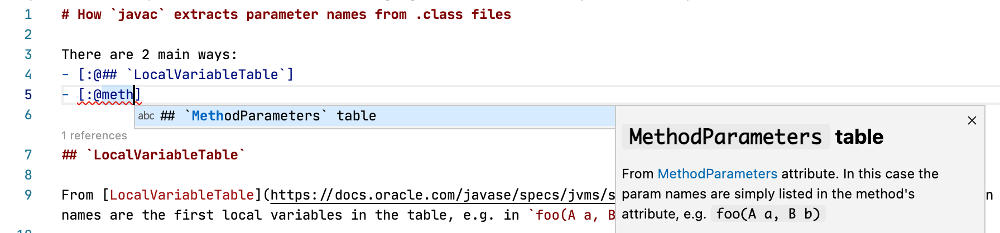
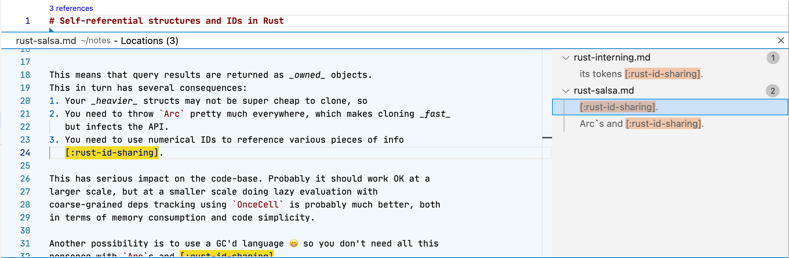
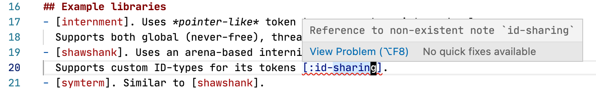

# Zeta Note VSCode

Integrates [Zeta Note][zn] language server into VSCode for delightful note
taking experience. The main use-case is [Zettelkasten-like][zettel-wiki]
note-taking, but you can write your notes any way you like really.

See the [project page][zn] for more detailed information.

## Screenshots

- Hover preview:
  
- Completion (note):
  
- Completion (heading):
  
- "Show References" Code Lens:
  
- Project-wide diagnostics for broken references:
  

## Installation

1. **Get `zeta-note` server binary**.
   The extension will try to automatically download Zeta Note language server
   from GH releases. This is the easiest way to get started.

   An alternative is to either download `zeta-note` binary from the [releases
   page][zn-releases] or to build `zeta-note` from source. Put it somewhere in
   your `PATH` and you should be good to go.
2. **Add `.zeta.toml` to your workspace root folder**.
   The extension is automatically activated only when `.zeta.toml` file is
   present. This is done to avoid running Zeta Note on random Markdown files,
   but rather only inside your notes folder.

## Extension Settings

- **Custom Command**: allows to specify a custom command to start
  `zeta-note`. Mostly useful for development of `zeta-note` itself.
- **Custom Command Dir**: allows to specify a CWD for the command above. For
  development it's convenient to set the command to `cargo run` and the command
  dir to the dir where `zeta-note` sources are.

[zettel-wiki]: https://en.wikipedia.org/wiki/Zettelkasten
[roam]: https://roamresearch.com
[md-memo]: https://github.com/svsool/vscode-memo
[zn]: https://github.com/artempyanykh/zeta-note
[zn-releases]: https://github.com/artempyanykh/zeta-note/releases